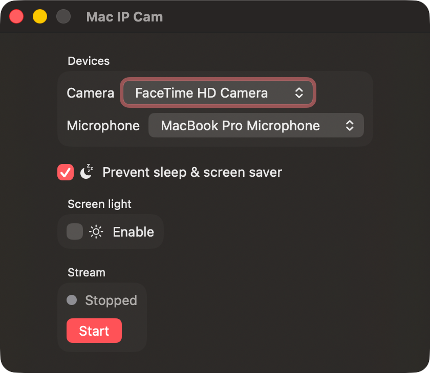
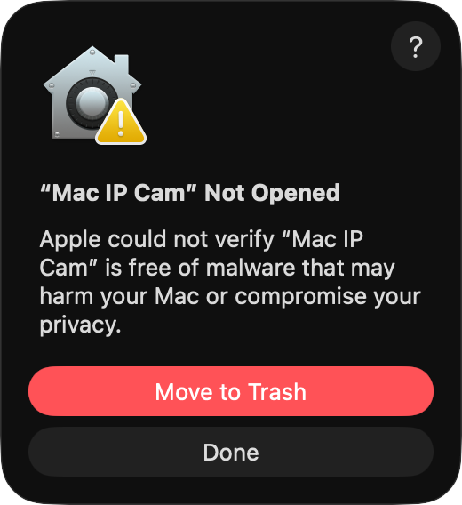

# Mac IP Cam

Turns your Mac's built-in or external webcam into a live **audio and video RTSP stream** on your local network. Any RTSP-capable client — VLC, ffplay, or a mobile IP camera app — can connect and watch the stream in real time.



## Story

My family visited my parents for the weekend and I realised I had no baby monitor for our second child. The idea came up to use the Mac's webcam instead. The app worked great, but the room was dark — so I added the **screen light** feature: the Mac's display expands to fill the screen with a soft, adjustable warm or cool light, improving visibility in low light without any additional lamps. It worked perfectly as a makeshift baby cam.

## How it works

1. Select your camera and microphone
2. Click **Start**
3. Connect any RTSP client (for example [VLC](https://www.videolan.org) for various platforms) to the displayed URL:
   ```
   rtsp://<your-mac-ip>:8554/webcam
   ```

## Features

- Live **video and audio** stream (H.264 + AAC) over RTSP on the local network
- Camera and microphone selection
- Optional audio — toggle microphone off for video-only stream
- **Screen light** — expands the window fullscreen and fills it with adjustable warm/cool light, useful as a fill light in dark rooms
- **Prevent sleep** — keeps the display and system awake while streaming

## Requirements

- macOS 13 Ventura or later
- Apple Silicon (arm64)

## Install

Download the latest DMG from the [Releases](../../releases) page, open it and drag **Mac IP Cam** to Applications.

### First launch — Gatekeeper warning

Because the app is not notarized, macOS will block it on first launch:



Click **Done**, then go to **System Settings → Privacy & Security**, scroll down and click **Open Anyway**.

Alternatively, run this once in Terminal:

```bash
xattr -cr "/Applications/Mac IP Cam.app"
```

## License

MIT — see [LICENSE](LICENSE)

Third-party components: [THIRD_PARTY_LICENSES.md](THIRD_PARTY_LICENSES.md)
